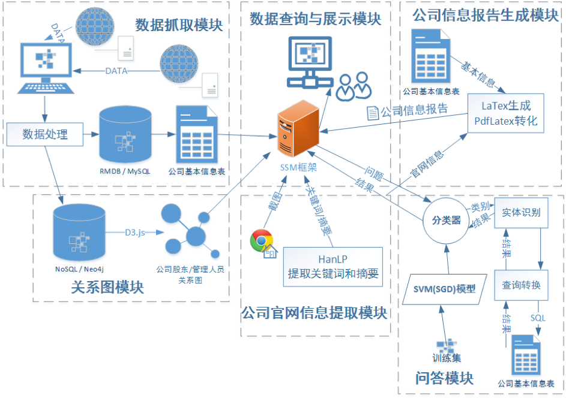
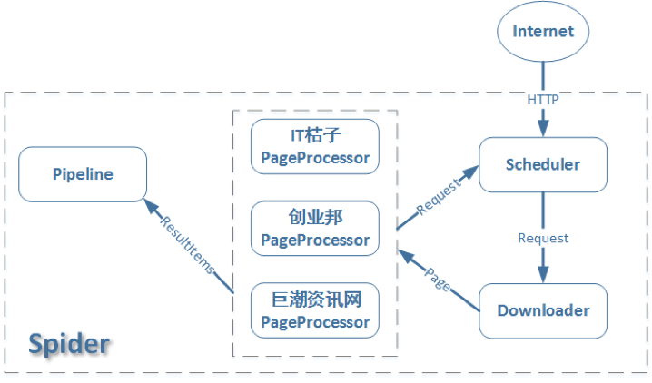
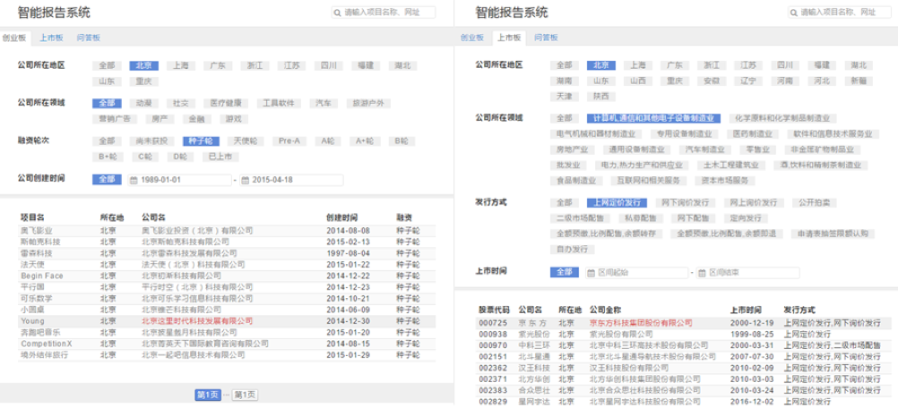
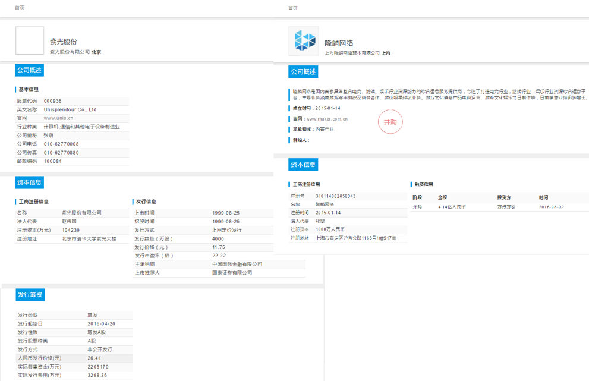
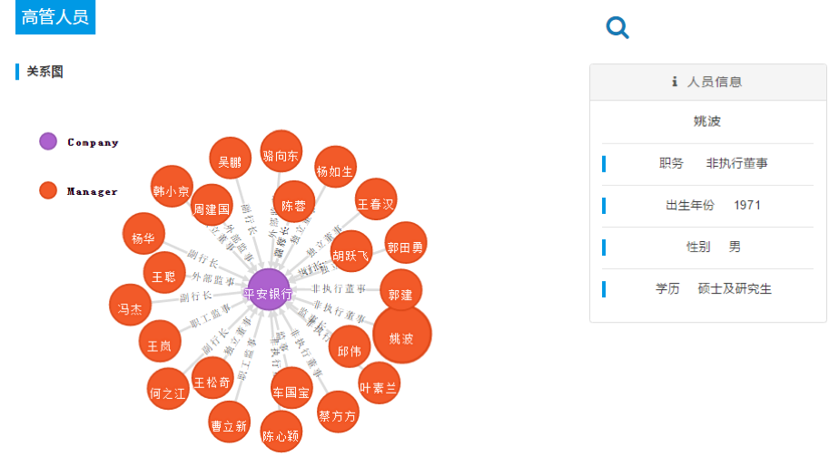
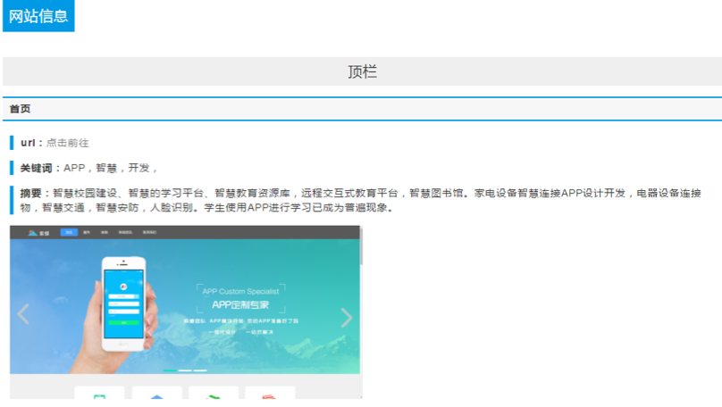
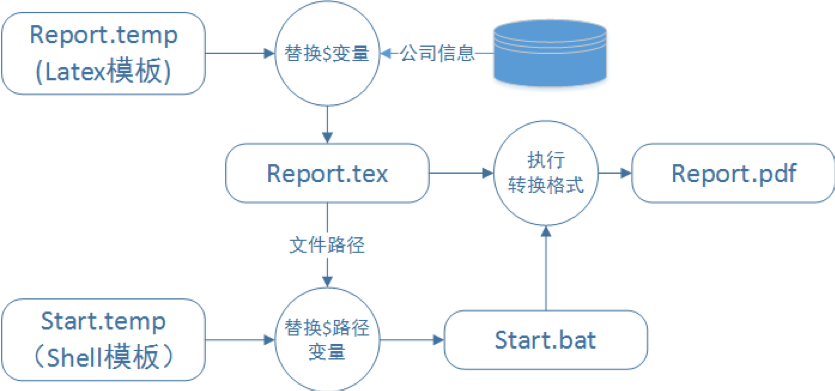
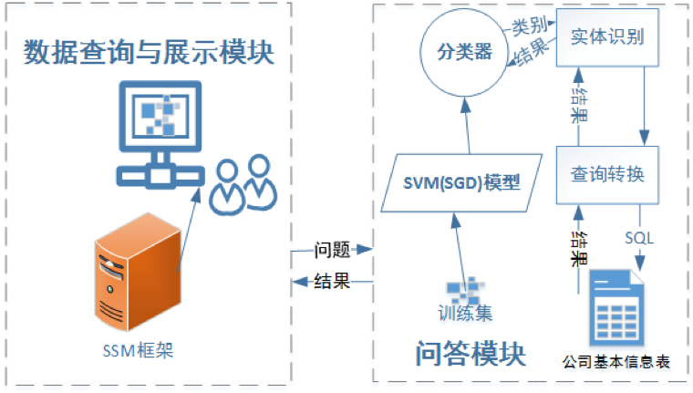
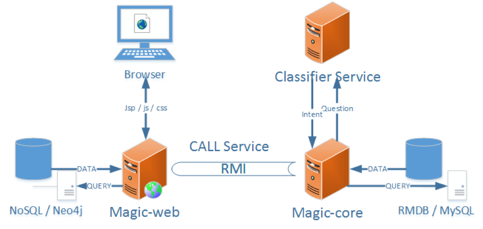

构建了一个基于自然语言处理的金融信息结构化系统。该系统主要实现了一个从多数据源的金融信息整合到统一结构化体系的金融信息结构化系统，并且通过自然语言处理技术，方便对结构化信息的查询和使用。金融信息结构化系统实现了从数据抓取与结构化、多功能筛选和搜索、结构化信息多方位展示、自动生成信息报告到基于自然语言处理技术的自动问答服务一套系统功能。

1. 数据爬取模块：从各个数据源抓取企业的基本信息，并且持久化到关系型数据库中。利用爬虫框架对几个信息门户爬取企业的基本信息，归纳出企业所要有的基本信息，设计页面规则和数据库表结构、将数据去噪后保存到数据库表中。

2. 数据查询与展示模块：搭建网站，用于查询和展示企业结构化信息。使用SSM框架（Spring、SpringMVC、MyBatis）搭建了一个网站，能够和数据库很方便地交互，查询和展示企业信息。在网站上展示企业信息的条件查询，提供几个条件，根据条件访问数据库，查询到的相应信息返回给前端界面上。

3. 关系图模块：将企业内高层人员关系通过关系图的形式展示。转换数据格式，导入到Neo4j图形数据库中，能够方便的查询结点与结点之间的关系，并且通过D3.js在前端页面中展示出Neo4j的查询结果。

4. 企业官网信息抽取模块：对企业官网进行图像信息的抽取和文本信息的抽取。访问企业的官网链接，抽取官网以及官网页面上主要链接中的关键词和摘要，并且对页面进行截图。从企业基本信息中的企业官网地址作为入口，利用Chrome浏览器进入页面截取官网图像信息，并且使用HanLP的抽取关键词和摘要的功能抽取出企业一些关键信息。这些信息都返回到前端页面进行展示。

5. 企业信息报告自动生成模块：负责自动整合企业的相关信息，包括基本信息和企业官网信息，最后生成PDF格式的企业信息报告，供前端页面下载，或发送到指定邮箱中。

6. 问答模块：能够为用户提供更直接的个性化信息查询服务，用户提交事实性的问题，为用户准确返回事实性结果。训练出的问题分类器模型以及实体识别作为一个web server提供一个RESTful API，提交问题到这个API，得到问题分类和实体。使用得到的信息转化为对数据库的查询，将查询结果返回给前端页面展示。

金融信息结构化系统的工作流程如下：

1. 从各个信息门户网站的原始数据到数据库中结构化的数据，经历了爬虫的规则式抓取、抓取后的清洗降噪、最后保存到预先设计好的数据库表中。使用WebMagic框架，首先设定了开始抓取页面的初始地址，再不断的发现新地址链接加入爬取队列，根据正则表达式的规则式匹配抽取每个访问页面中的有效内容。为了去除无效数据，加入更多关于无效数据的判断。最后抽取出来的结构化数据，通过优秀的持久化层框架MyBatis，保存到MySQL数据库中。

2. 使用SSM（Spring、SpringMVC、MyBatis）框架，进行基本的配置，搭建起一个基本的网站。用户通过用户界面查看所有企业列表，通过设定条件，如企业地区、企业领域、发行方式/融资轮次、上市时间/创建时间等，筛选出符合条件的企业，也可以直接在搜索框输入企业名或者企业官网进行搜索和访问。这些用户的请求和访问行为被SpringMVC的控制器获取解析并且返回相应页面。结合MyBatis框架搜索数据库，查询结果与页面视图一起返回给用户。

3. 搜索出所需的企业点击详情链接跳转到企业的详情界面查看更多的内容。详情页面中包含了企业基本信息和企业官网信息。其中企业官网信息是服务器在线访问基本信息中的官网地址展示出来的。首先企业官网信息包含了三大部分，分别是官网每个页面的截图、关键词及摘要。当访问官网时，马上调用Chrome浏览器的程序进行页面的访问，并且截图保存到一个特定文件夹中。在跳转下个页面前，使用Jsoup解析HTML页面，提取其中的纯文本内容。利用提取出的存文本，调用HanLP工具包中的关键词和摘要算法，即PageRank和TextRank算法，抽取出关键词和摘要返回到用户界面。

4. 在上市板企业详情界面包含了高层人员关系图。该关系图是以企业为中心结点，围绕着代表高层人员的结点，企业与高层人员之间是以高层人员的职位信息作为连接信息。关系图的信息是保存在图形数据库Neo4j中的。图形数据库中的数据格式和关系型数据库中的截然不同，关系型数据库里的数据需要进行数据格式转换后再导入图形数据库中。Neo4j中有了数据后，使用特定的查询语言Cypher能够快速地查询到相关信息。查询结果返回到前端，使用强大的数据可视化组件D3.js将关系图数据展示给用户。

5. 在详情界面的底部附有生成企业信息报告的按钮，可以在线生成关于该企业的信息报告。企业报告的内容包括了企业基本信息和企业官网信息。企业基本信息从MySQL可以很容易获取，企业的官网信息通过调用企业官网信息抽取模块获取。有了两者信息，结合预先设计好的LaTex模板，在模板的相应位置替换对应信息，可以预先得到一个tex格式的报告。由于pdf是更为大众所接受的文档格式，使用LaTex里的pdflatex组件，对tex格式的报告格式转换为pdf格式。最后将pdf格式的企业信息报告返回到用户界面供用户下载。

6. 该系统带有一个高效的查询方式——问答模块。在问题框中输入事实性问题即可很快返回所需的确切答案。用户提交问题后传递到相应控制器处理，控制器首先传给分类器，得到了分类类型和企业实体以及其他实体后，交由转换查询的函数，根据不同的分类类型向数据库进行访问查询，最后将结果即答案返回给用户。